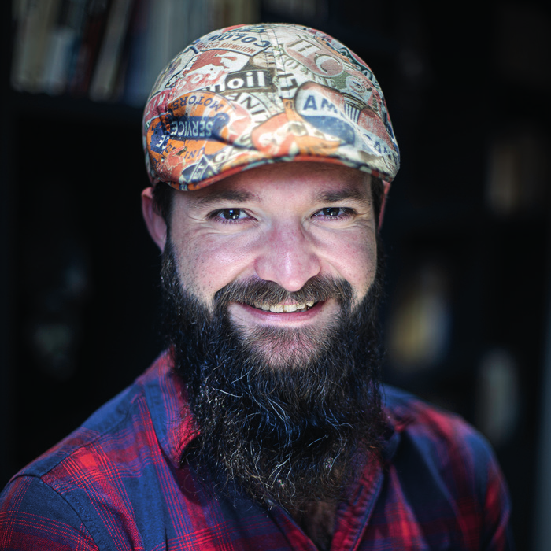

[.entrypoint]
= !
:source-highlighter: highlightjs
:revealjs_theme: black
:revealjs_progress: true
:revealjs_history: true
:customcss: ./styles/yannschepens/stylesheets/style.css
:revealjsdir: ./node_modules/reveal.js
:revealjs_defaultTiming: 40

[.intro-block]
[cols="1,2",frame=none,grid=none]
|===
a|[.yann-intro]

[.yann-name]
Yann Schepens
[.yann-role]
Tech Lead +
@onepoint
a|[.yann-intro-title]
L'observabilité en vrai : logs, lessive et 350 VMs

[.yann-intro-event]
Yann Day : 9 juin 1987
|===

[NOTE.speaker]
====
* Bonjour,

* Bienvenue chez NettoieLogs2000 "Expert en observabilité", entreprise de nettoyage et stockage de logs en tout genre

* Transition : Mais avant de commencer, qui suis-je ?
====

include::pages/start.adoc[leveloffset=+1]
include::pages/intro.adoc[leveloffset=+1]
include::pages/rex1-general-monitoring.adoc[leveloffset=+1]
include::pages/rex2-elk.adoc[leveloffset=+1]
include::pages/rex3-350vms.adoc[leveloffset=+1]
include::pages/synthesis.adoc[leveloffset=+1]

include::pages/end.adoc[leveloffset=+1]
